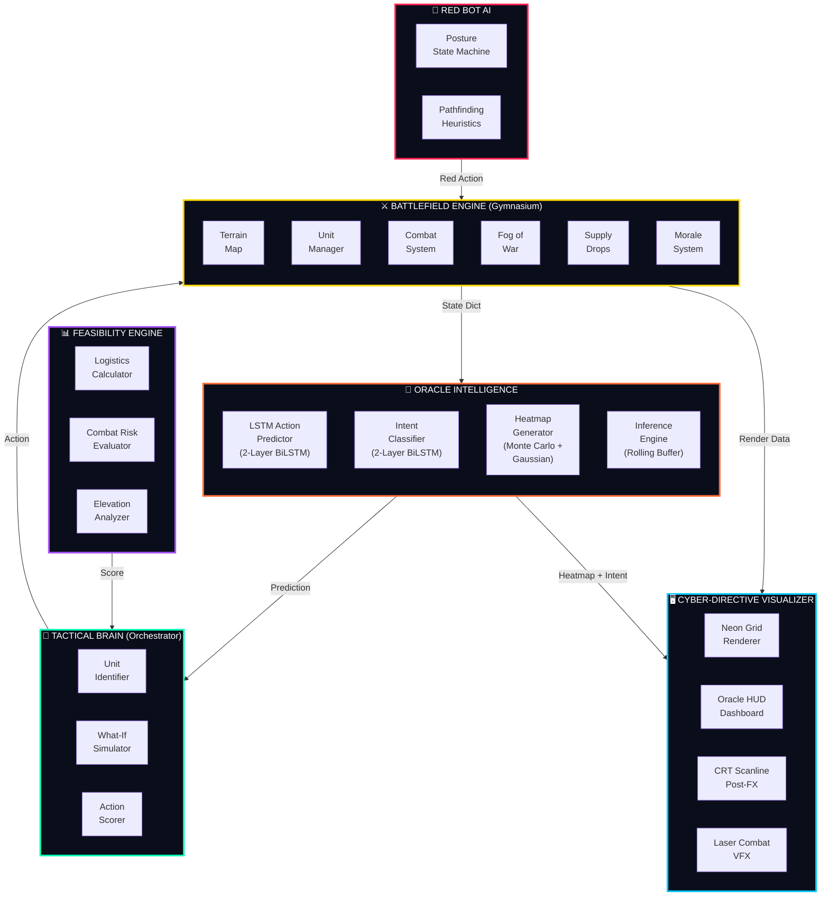
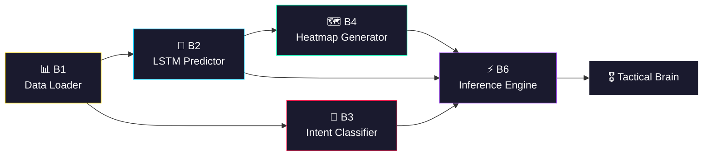
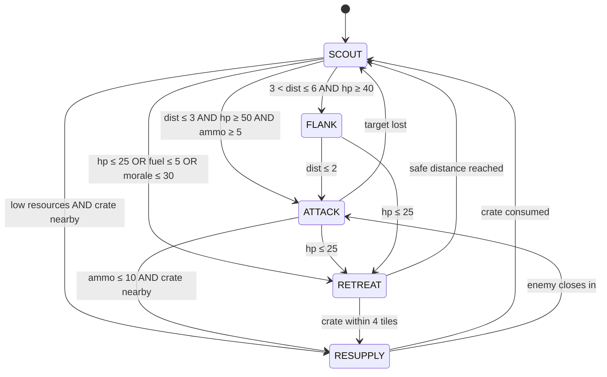

<div align="center">

<!-- ═══════════════════════════════════════════════════════════════════ -->
<!--                        ANIMATED HEADER                            -->
<!-- ═══════════════════════════════════════════════════════════════════ -->

[](https://github.com/Ronit178693/TDASS)

<br/>

<!-- Animated Typing Banner -->


<br/>
<br/>

<!-- Tech Stack Badges -->


<br/>
<br/>

<!-- Status Badges -->


<br/>
<br/>

> **A real-time, AI-powered tactical battlefield simulation where a trained LSTM Oracle predicts enemy movements, classifies hostile intent, generates probability heatmaps, and drives intelligent Blue-force decision-making — all rendered through a cinematic Cyber-Directive neon interface.**

<br/>

</div>

---

<!-- ═══════════════════════════════════════════════════════════════════ -->
<!--                       TABLE OF CONTENTS                           -->
<!-- ═══════════════════════════════════════════════════════════════════ -->

## 📑 Table of Contents

<details>
<summary><b>🔽 Click to Expand Full Navigation</b></summary>
<br/>

| # | Section | Description |
|:---:|:---|:---|
| 1 | [🎯 Project Overview](#-project-overview) | What TDASS is and why it exists |
| 2 | [🏗️ System Architecture](#️-system-architecture) | Full multi-layer architecture diagram |
| 3 | [📂 Project Structure](#-project-structure) | Complete file tree with descriptions |
| 4 | [⚙️ The Battlefield Engine](#️-the-battlefield-engine---battle_envpy) | Gymnasium environment deep-dive |
| 5 | [🧠 The Oracle Intelligence](#-the-oracle-intelligence---oracle) | LSTM models, training, and inference |
| 6 | [🎖️ The Tactical Brain](#️-the-tactical-brain---braintactical_brainpy) | Decision orchestration layer |
| 7 | [🔴 The Red Bot AI](#-the-red-bot-ai---element_logicred_strategypy) | Enemy OODA-loop state machine |
| 8 | [📊 The Feasibility Engine](#-the-feasibility-engine---feasibilityfeasibility_enginepy) | Risk and logistics scoring |
| 9 | [🖥️ The Cyber-Directive Visualizer](#️-the-cyber-directive-visualizer---visualize_oraclepy) | Neon HUD and rendering pipeline |
| 10 | [📈 Data Pipeline](#-data-pipeline---simulationpy) | Synthetic dataset generation |
| 11 | [🚀 Quick Start](#-quick-start) | Installation and launch guide |
| 12 | [🔬 Technical Specifications](#-technical-specifications) | Model hyperparameters and constants |
| 13 | [🗺️ Roadmap](#️-roadmap) | Future development plans |

</details>

---

<!-- ═══════════════════════════════════════════════════════════════════ -->
<!--                       PROJECT OVERVIEW                            -->
<!-- ═══════════════════════════════════════════════════════════════════ -->

## 🎯 Project Overview

<div align="center">

```
╔══════════════════════════════════════════════════════════════════════╗
║                                                                      ║
║   TDASS is not a game. It is an AI warfare research platform.        ║
║                                                                      ║
║   It simulates a multi-agent tactical battlefield where a trained    ║
║   neural Oracle (LSTM) predicts enemy behavior in real-time,         ║
║   generates spatial threat maps, and drives autonomous Blue-force    ║
║   decision-making through a feasibility-weighted action scoring      ║
║   system — all visualized through a cinematic neon command center.   ║
║                                                                      ║
╚══════════════════════════════════════════════════════════════════════╝
```

</div>

### 🔑 Core Capabilities

| Capability | Implementation | Status |
|:---|:---|:---:|
| **Enemy Movement Prediction** | 2-Layer Bidirectional LSTM (Action Predictor) | ✅ Trained |
| **Hostile Intent Classification** | 2-Layer Bidirectional LSTM (Posture Classifier) | ✅ Trained |
| **Spatial Threat Mapping** | Monte Carlo Rollout + Gaussian Diffusion Heatmaps | ✅ Live |
| **Autonomous Blue-Force AI** | Feasibility-Weighted Action Scoring via Tactical Brain | ✅ Active |
| **Adversarial Red Bot** | 5-Posture OODA-Loop State Machine (SCOUT/ATTACK/RETREAT/FLANK/RESUPPLY) | ✅ Active |
| **Rich Battlefield Physics** | 6 Terrains, Fog of War, Elevation, Morale, Supply Drops, Combat | ✅ Simulated |
| **Cinematic Visualization** | Neon Cyber-Directive HUD with CRT Scanlines, Laser VFX, Pulsing Radar | ✅ Rendered |
| **Full Codebase Annotation** | Every single line of code has a descriptive comment | ✅ 100% |

---

<!-- ═══════════════════════════════════════════════════════════════════ -->
<!--                      SYSTEM ARCHITECTURE                          -->
<!-- ═══════════════════════════════════════════════════════════════════ -->

## 🏗️ System Architecture

<div align="center">



</div>

### 🔄 Data Flow — One Complete Tick

```
┌─────────────┐    ┌──────────────┐    ┌────────────────┐    ┌──────────────┐
│  BATTLEFIELD │───▷│    ORACLE     │───▷│ TACTICAL BRAIN │───▷│  BATTLEFIELD │
│  State Dict  │    │  Prediction  │    │  Best Action   │    │  Next State  │
└─────────────┘    └──────────────┘    └────────────────┘    └──────────────┘
       │                  │                     │                     │
       │           ┌──────┴──────┐        ┌─────┴──────┐             │
       │           │ • Heatmap   │        │ • 6 Actions│             │
       │           │ • Intent    │        │ • What-If  │             │
       │           │ • Confidence│        │ • Scoring  │             │
       │           └─────────────┘        └────────────┘             │
       │                                                             │
       └─────────────────────────────────────────────────────────────┘
                              LOOP (1 FPS)
```

---

<!-- ═══════════════════════════════════════════════════════════════════ -->
<!--                      PROJECT STRUCTURE                            -->
<!-- ═══════════════════════════════════════════════════════════════════ -->

## 📂 Project Structure

```
TDASS/
│
├── 🖥️  visualize_oracle.py          ← MAIN ENTRY POINT — Cyber-Directive Visualizer
├── ⚔️  battle_env.py                ← Gymnasium Battlefield Engine (953 lines)
├── 🎲  simulation.py                ← Synthetic Data Generation Pipeline
├── 📋  requirements.txt             ← Python Dependencies
│
├── 🧠 oracle/                       ← NEURAL INTELLIGENCE MODULE
│   ├── __init__.py                  ← Module registration & docstring
│   ├── data_loader.py               ← B1: CSV preprocessing & windowed sequences
│   ├── lstm_predictor.py            ← B2: 2-Layer BiLSTM Action Predictor
│   ├── intent_classifier.py         ← B3: 2-Layer BiLSTM Intent Classifier
│   ├── heatmap_generator.py         ← B4: Monte Carlo + Gaussian Heatmaps
│   ├── inference_engine.py          ← B6: Stateful Real-Time Inference Wrapper
│   ├── train_oracle.py              ← B5: Full Training Pipeline + Checkpointing
│   └── checkpoints/
│       ├── action_predictor_best.pt ← Trained LSTM weights (2.3 MB)
│       ├── intent_classifier_best.pt← Trained Classifier weights (1.5 MB)
│       ├── training_curves.png      ← Loss/Accuracy visualization
│       └── training_summary.json    ← Hyperparameter archive
│
├── 🎖️ brain/                        ← DECISION ORCHESTRATION MODULE
│   ├── __init__.py
│   └── tactical_brain.py            ← v14.0: Oracle + Feasibility Integration
│
├── 📊 feasibility/                   ← RISK & LOGISTICS MODULE
│   ├── __init__.py
│   └── feasibility_engine.py        ← Path cost, combat risk, elevation scoring
│
└── 🔴 Element_Logic/                 ← ADVERSARIAL AI MODULE
    ├── __init__.py
    ├── red_strategy.py              ← 5-Posture OODA-Loop State Machine
    └── Synthetic_dataset/
        └── battle_data.csv          ← 100,000-row training dataset (9.9 MB)
```

---

<!-- ═══════════════════════════════════════════════════════════════════ -->
<!--                      BATTLEFIELD ENGINE                           -->
<!-- ═══════════════════════════════════════════════════════════════════ -->

## ⚙️ The Battlefield Engine — `battle_env.py`

<div align="center">

  

</div>

The heart of TDASS. A fully custom **OpenAI Gymnasium** environment that simulates a rich, multi-agent tactical battlefield.

### 🗺️ Terrain System (6 Types)

| Code | Terrain | Move Cost | Cover (DMG Reduction) | Passable | Visual |
|:---:|:---|:---:|:---:|:---:|:---:|
| `0` | **Plains** | 1.0× | 0% | ✅ | 🟫 |
| `1` | **Wall** | ∞ | — | ❌ | ⬛ |
| `2` | **Forest** | 1.5× | 30% | ✅ | 🟩 |
| `3` | **Water** | ∞ | — | ❌ | 🟦 |
| `4` | **Urban** | 2.0× | 40% | ✅ | 🏙️ |
| `5` | **Road** | 0.5× | 0% | ✅ | 🟨 |

### 🎖️ Unit Resource Model

Every unit (Blue & Red) carries **individual state**:

```
┌──────────────────────────────────────────────────────┐
│  UNIT STATE DICTIONARY                               │
├──────────────┬───────────────────────────────────────┤
│  id          │  Unique identifier (e.g., "B0", "R1") │
│  team        │  "blue" or "red"                       │
│  pos         │  [row, col] grid coordinate            │
│  hp          │  0–100 (Health Points)                 │
│  ammo        │  0–50  (Projectile Count)              │
│  fuel        │  0–100 (Movement Energy)               │
│  morale      │  20–150 (Psychological State)          │
│  kills       │  Kill counter                          │
│  alive       │  Boolean existence flag                │
└──────────────┴───────────────────────────────────────┘
```

### ⚔️ Combat Mechanics

| Type | Damage | Range | Ammo Cost | Notes |
|:---|:---:|:---:|:---:|:---|
| **Melee** | 30 base | Adjacent (1) | 0 | Triggers counter-attack (15 dmg) on survival |
| **Ranged** | 20 base | ≤ 3 Manhattan | 5 | Auto-targets nearest enemy in range |

**Damage Modifiers Stack Multiplicatively:**
```
Final Damage = Base × (1 - Cover%) × Elevation Bonus × Morale Multiplier

Where:
  • Cover%         = 0.0 (Plains/Road) | 0.3 (Forest) | 0.4 (Urban)
  • Elevation      = 1.25× if attacker is higher | 1.0× otherwise
  • Morale Factor  = 0.5 + 0.5 × (morale / 100)
```

### 🌫️ Fog of War

- Each Blue unit reveals tiles within **Manhattan distance 4**
- Red units in fogged tiles are **invisible** to the visualizer
- The Oracle still tracks Red positions for prediction

### 📦 Supply Drop System

| Property | Value |
|:---|:---|
| Spawn Chance | 8% per tick |
| HP Restored | +25 |
| Ammo Restored | +15 |
| Fuel Restored | +30 |
| Pickup | Automatic on tile entry |

### 💀 Morale System

```
Event                    │ Effect
─────────────────────────┼─────────
Friendly unit dies       │ -20 morale (team-wide)
Enemy unit killed        │ +15 morale (team-wide)
HP drops below 30        │ -10 morale (per tick)
─────────────────────────┼─────────
Range: [20, 150]         │ Default: 100
```

### 📐 Elevation Layer

```
Height Map (10×10):
  • [4:6, 4:6] = 2 (Urban Hilltop — Strategic Chokepoint)
  • [0:2, 0:2] = 1 (Blue Spawn Ridge)
  • [8:10, 8:10] = 1 (Red Spawn Ridge)
  • [3, 7] = 2 (Sniper Bluff — Overlooks Water)
  
  High Ground Bonus: +25% damage when attacking downhill
```

### 🎬 Particle System

The engine includes a lightweight **VFX particle emitter** for:
- 💥 **Melee impacts** — Golden sparks (12 particles, speed 4.0)
- 🔫 **Ranged tracers** — Orange impact + blue muzzle flash
- Particles have randomized angle, speed, lifetime, and size

---

<!-- ═══════════════════════════════════════════════════════════════════ -->
<!--                      ORACLE INTELLIGENCE                          -->
<!-- ═══════════════════════════════════════════════════════════════════ -->

## 🧠 The Oracle Intelligence — `oracle/`

<div align="center">

 

</div>

The Oracle is a **6-component neural intelligence pipeline** that observes enemy behavior in real-time and predicts what they will do next.

### 🔮 Oracle Component Map



---

### 📊 B1 — Data Loader (`data_loader.py`)

**Purpose:** Transforms raw CSV battle data into normalized, windowed sequences for LSTM training.

**Feature Vector (12 Dimensions):**

| # | Feature | Normalization Range | Description |
|:---:|:---|:---:|:---|
| 1 | `red_x` | [0, 9] | Red horizontal position |
| 2 | `red_y` | [0, 9] | Red vertical position |
| 3 | `blue_x` | [0, 9] | Blue horizontal position |
| 4 | `blue_y` | [0, 9] | Blue vertical position |
| 5 | `red_hp` | [0, 100] | Red health points |
| 6 | `red_ammo` | [0, 50] | Red ammunition |
| 7 | `red_fuel` | [0, 100] | Red movement energy |
| 8 | `red_morale` | [20, 150] | Red psychological state |
| 9 | `red_elevation` | [0, 2] | Red height advantage |
| 10 | `distance` | [0, 18] | Manhattan distance between forces |
| 11 | `fog_visible` | [0, 1] | Blue's sensor visibility |
| 12 | `red_prev_action` | [0, 5] | Red's last executed action |

**Sliding Window:** Sequences of **10 consecutive timesteps** are formed for temporal pattern learning.

---

### 🧠 B2 — LSTM Action Predictor (`lstm_predictor.py`)

**Purpose:** Predicts the **next action** (0–5) the Red unit will take.

```
Architecture:
  ┌─────────────────────────────────────────────────────┐
  │  Input: (batch, seq_len=10, features=12)            │
  │                    ▼                                │
  │  ┌─────────────────────────────────┐                │
  │  │  nn.LSTM                        │                │
  │  │  • hidden_size = 128            │                │
  │  │  • num_layers  = 2              │                │
  │  │  • bidirectional = True         │                │
  │  │  • dropout = 0.2               │                │
  │  └─────────────────────────────────┘                │
  │                    ▼                                │
  │  Last Timestep Extraction: lstm_out[:, -1, :]       │
  │                    ▼                                │
  │  ┌─────────────────────────────────┐                │
  │  │  Classifier Head                │                │
  │  │  Linear(256 → 128) → ReLU      │                │
  │  │  Dropout(0.2)                   │                │
  │  │  Linear(128 → 6)               │                │
  │  └─────────────────────────────────┘                │
  │                    ▼                                │
  │  Output: 6-class action probabilities               │
  └─────────────────────────────────────────────────────┘

  Total Parameters: ~2.3 MB
  Checkpoint: oracle/checkpoints/action_predictor_best.pt
```

---

### 🎯 B3 — Intent Classifier (`intent_classifier.py`)

**Purpose:** Classifies the Red unit's **tactical posture** (SCOUT/ATTACK/RETREAT/FLANK/RESUPPLY).

```
Architecture:
  ┌─────────────────────────────────────────────────────┐
  │  Input: (batch, seq_len=10, features=12)            │
  │                    ▼                                │
  │  ┌─────────────────────────────────┐                │
  │  │  Feedforward Encoder            │                │
  │  │  Linear(12 → 64) → ReLU        │                │
  │  └─────────────────────────────────┘                │
  │                    ▼                                │
  │  ┌─────────────────────────────────┐                │
  │  │  nn.LSTM                        │                │
  │  │  • input_size   = 64            │                │
  │  │  • hidden_size  = 96            │                │
  │  │  • num_layers   = 2             │                │
  │  │  • bidirectional = True         │                │
  │  └─────────────────────────────────┘                │
  │                    ▼                                │
  │  Mean Pooling: torch.mean(lstm_out, dim=1)          │
  │                    ▼                                │
  │  ┌─────────────────────────────────┐                │
  │  │  Classifier Head                │                │
  │  │  Linear(192 → 96) → ReLU       │                │
  │  │  Dropout(0.2)                   │                │
  │  │  Linear(96 → 5)                │                │
  │  └─────────────────────────────────┘                │
  │                    ▼                                │
  │  Output: 5-class posture probabilities              │
  │  [SCOUT, ATTACK, RETREAT, FLANK, RESUPPLY]          │
  └─────────────────────────────────────────────────────┘

  Total Parameters: ~1.5 MB
  Checkpoint: oracle/checkpoints/intent_classifier_best.pt
```

**Key Difference from B2:** Uses a **feedforward encoder** before the LSTM and **mean pooling** (instead of last-step extraction) for more robust temporal representation.

---

### 🗺️ B4 — Heatmap Generator (`heatmap_generator.py`)

**Purpose:** Generates a **10×10 probability grid** predicting where the Red unit is most likely to be in `N` future steps.

**Two Complementary Methods:**

| Method | Speed | Accuracy | Algorithm |
|:---|:---:|:---:|:---|
| **Monte Carlo Rollout** | 🐢 Slow | 🎯 High | Simulates N steps using LSTM action distribution; averages positions over K rollouts |
| **Gaussian Diffusion** | ⚡ Fast | 📏 Approximate | Converts LSTM action probabilities into directional weights; applies `scipy.ndimage.gaussian_filter` blur |

```
Monte Carlo Pipeline:
  1. Get LSTM softmax output → action probabilities
  2. Sample K trajectories (default 50)
  3. For each trajectory, simulate N steps
  4. Accumulate visited positions into 10×10 grid
  5. Normalize to [0, 1] probability distribution

Gaussian Pipeline:
  1. Get LSTM softmax output → action probabilities
  2. Map probabilities to (Δrow, Δcol) weighted vectors
  3. Shift current position by weighted direction
  4. Apply gaussian_filter(sigma=1.5) for spatial diffusion
  5. Normalize to [0, 1]
```

---

### ⚡ B6 — Inference Engine (`inference_engine.py`)

**Purpose:** The **real-time orchestrator** that ties all Oracle components together during live simulation.

```
┌──────────────────────────────────────────────────────────────┐
│                   INFERENCE ENGINE                            │
│                                                              │
│  ┌─────────────┐                                             │
│  │ Rolling      │  Maintains a deque of the last 10 state    │
│  │ History      │  vectors for windowed LSTM input.           │
│  │ Buffer       │  (collections.deque, maxlen=10)            │
│  └──────┬──────┘                                             │
│         ▼                                                    │
│  ┌──────────────┐  ┌──────────────┐  ┌──────────────┐       │
│  │ B2: Action   │  │ B3: Intent   │  │ B4: Heatmap  │       │
│  │ Predictor    │  │ Classifier   │  │ Generator    │       │
│  └──────┬───────┘  └──────┬───────┘  └──────┬───────┘       │
│         ▼                 ▼                 ▼                │
│  ┌──────────────────────────────────────────────────┐        │
│  │                PREDICTION DICT                    │        │
│  │  {                                                │        │
│  │    'posture':    "ATTACK",                        │        │
│  │    'confidence': 0.847,                           │        │
│  │    'heatmap':    np.array(10×10),                 │        │
│  │    'action_probs': [0.05, 0.1, 0.6, ...]         │        │
│  │  }                                                │        │
│  └──────────────────────────────────────────────────┘        │
└──────────────────────────────────────────────────────────────┘
```

**Critical Design Decision:** The Oracle's LSTM hidden states are updated **exactly once per turn** to prevent simulation freezes and ensure temporal consistency.

---

### 🏋️ B5 — Training Pipeline (`train_oracle.py`)

**Full training loop** with:
- 80/20 train/validation split
- **Adam optimizer** with learning rate scheduling
- **CrossEntropyLoss** for both models
- Best-model checkpointing based on validation loss
- Training curve visualization (saved as PNG)
- JSON summary export of hyperparameters

---

<!-- ═══════════════════════════════════════════════════════════════════ -->
<!--                       TACTICAL BRAIN                              -->
<!-- ═══════════════════════════════════════════════════════════════════ -->

## 🎖️ The Tactical Brain — `brain/tactical_brain.py`

<div align="center">

 

</div>

The Brain is the **central command layer** that combines Oracle predictions with the Feasibility Engine to select the best action for each Blue unit.

### Decision Algorithm (Per Unit Per Tick)

```
FOR each of 6 possible actions (Stay, Up, Down, Left, Right, RangedAttack):

  1. SIMULATE the hypothetical new position
  2. CHECK boundary validity
  3. QUERY Feasibility Engine:
     ├── Logistics Score  (fuel cost vs. current fuel)     × 0.4 weight
     ├── Survival Score   (HP vs. Oracle threat at tile)   × 0.5 weight
     └── Elevation Score  (uphill penalty = 0.8)           × 0.1 weight
  4. ADD Strategic Bias:
     ├── ATTACK bonus:  +15.0 if enemy in range AND ammo > 0
     ├── NO-AMMO penalty: -20.0 if trying to fire empty
     ├── AGGRESSION bias: +0.5 if move closes distance to enemy
     └── ROAD bonus: +0.2 if destination is a road tile

  RETURN action with highest total score (argmax)
```

---

<!-- ═══════════════════════════════════════════════════════════════════ -->
<!--                         RED BOT AI                                -->
<!-- ═══════════════════════════════════════════════════════════════════ -->

## 🔴 The Red Bot AI — `Element_Logic/red_strategy.py`

<div align="center">

 

</div>

The enemy operates on a **5-posture OODA (Observe-Orient-Decide-Act) loop**:



### Posture Behaviors

| Posture | Movement Logic | Combat |
|:---|:---|:---|
| **🔍 SCOUT** | Random valid movement | None |
| **⚔️ ATTACK** | Minimize distance to nearest Blue | Ranged fire at ≤3 range |
| **🛡️ RETREAT** | Maximize distance + seek Forest/Urban cover | None |
| **🔄 FLANK** | Perpendicular movement, then close in | Switch to ATTACK at ≤2 |
| **📦 RESUPPLY** | Path toward nearest supply crate | None |

### Pathfinding Heuristics

| Function | Algorithm | Purpose |
|:---|:---|:---|
| `_action_toward()` | Greedy Manhattan minimization | Close distance to target |
| `_action_away()` | Greedy Manhattan maximization | Increase distance from threat |
| `_action_toward_cover()` | Distance + Cover bonus scoring | Retreat to defensive terrain |
| `_action_flank()` | Lateral axis detection + perpendicular movement | Indirect approach |
| `_get_valid_actions()` | Boundary + terrain passability filter | Movement validation |

---

<!-- ═══════════════════════════════════════════════════════════════════ -->
<!--                     FEASIBILITY ENGINE                            -->
<!-- ═══════════════════════════════════════════════════════════════════ -->

## 📊 The Feasibility Engine — `feasibility/feasibility_engine.py`

<div align="center">


</div>

Validates proposed actions by computing a **weighted feasibility score (0.0 – 1.0)**:

```
Final Score = (Logistics × 0.4) + (Survival × 0.5) + (Elevation × 0.1)
```

### Three Evaluation Axes

| Axis | Method | Formula |
|:---|:---|:---|
| **Logistics** | `calculate_path_cost()` | `1.0 - (terrain_cost × distance) / fuel` |
| **Survival** | `evaluate_combat_risk()` | `(hp / 100) × (1.0 - oracle_threat)` — scans 3×3 kernel around target tile |
| **Elevation** | Direct comparison | `1.0` if flat/downhill, `0.8` if uphill (20% penalty) |

### Terrain Cost Table (Feasibility Engine)

| Terrain | Engine Cost | Note |
|:---|:---:|:---|
| Plains | 1.0 | Standard |
| Wall | 99.0 | Effectively impassable |
| Forest | 2.0 | Slow but safe |
| Water | 5.0 | Very difficult |
| Road | 0.5 | Most efficient |
| Urban | 1.5 | Moderate |

---

<!-- ═══════════════════════════════════════════════════════════════════ -->
<!--                    CYBER-DIRECTIVE VISUALIZER                     -->
<!-- ═══════════════════════════════════════════════════════════════════ -->

## 🖥️ The Cyber-Directive Visualizer — `visualize_oracle.py`

<div align="center">

  

</div>

The visualizer renders the entire system through a **cinematic military command center aesthetic**.

### 🎨 Screen Layout

```
┌──────────────────────────────────────┬────────────────────────────┐
│                                      │                            │
│                                      │  🧠 ORACLE INTEL DASHBOARD │
│                                      │                            │
│                                      │  PREDICTED ENEMY INTENT:   │
│                                      │  [ ATTACK ]                │
│        10×10 TACTICAL GRID           │                            │
│    (600×600px with 60px tiles)       │  ORACLE CONFIDENCE: 84.7%  │
│                                      │  ████████████░░░░░░        │
│    • Neon grid lines                 │                            │
│    • Pulsing Oracle heatmap          ├────────────────────────────┤
│    • Fog of War overlay              │                            │
│    • Floating HP bars                │  🔴 ENEMY THREAT STATUS    │
│    • Glowing unit rings              │                            │
│    • Neon laser combat VFX           │  R0: POS [5,3] HP:▓▓▓░    │
│    • Animated "?" on risk tiles      │  R1: --- NEUTRALIZED ---   │
│    • Golden supply crate icons       │                            │
│    • Crosshair hover highlight       ├────────────────────────────┤
│                                      │                            │
│                                      │  🔎 ORACLE RISK SIGNATURE  │
│                                      │  PROBE: [4, 7]             │
│                                      │  TERRAIN: FOREST           │
│                                      │  THREAT: 23.45%            │
│                                      │                            │
└──────────────────────────────────────┴────────────────────────────┘
         GRID AREA (680px)                   HUD PANEL (540px)
```

### 🌈 Color Theme — Neon Tactical

| Element | RGB Value | Hex | Purpose |
|:---|:---:|:---:|:---|
| Background | `(5, 8, 12)` | `#05080C` | Deep space black |
| Grid Lines | `(20, 35, 55)` | `#142337` | Subtle military blue |
| Blue Units | `(0, 200, 255)` | `#00C8FF` | Cyan neon — friendly |
| Red Units | `(255, 30, 80)` | `#FF1E50` | Hot pink-red — hostile |
| Supply Crates | `(255, 215, 0)` | `#FFD700` | Gold — resources |
| Intel Labels | `(0, 255, 180)` | `#00FFB4` | Tech-green — data |
| Body Text | `(200, 220, 240)` | `#C8DCF0` | Off-white — readable |

### ✨ Visual Effects Pipeline

| Layer | Effect | Implementation |
|:---:|:---|:---|
| 0 | **Background Fill** | `screen.fill(COLOR_BG)` |
| 1 | **Crosshair Highlight** | Semi-transparent row + column rectangle on hover |
| 2 | **Terrain Grid** | Color-mapped 60×60 rectangles per tile |
| 3 | **Oracle Heatmap** | Sinusoidal pulsing alpha overlay + animated `?` glyphs |
| 4 | **Fog of War** | Dark navy overlay (alpha=210) on invisible tiles |
| 5 | **Supply Crates** | White border + golden inner square |
| 6 | **Unit Rings** | 3-ring concentric glow + solid core circle |
| 7 | **HP Bars** | Floating green bars directly under units |
| 8 | **Neon Lasers** | Flickering yellow/white tracer lines on combat |
| 9 | **HUD Dashboard** | Dark panel with intent card, threat scanner, risk probe |
| 10 | **CRT Scanlines** | Semi-transparent horizontal lines every 4px (alpha=45) |

---

<!-- ═══════════════════════════════════════════════════════════════════ -->
<!--                       DATA PIPELINE                               -->
<!-- ═══════════════════════════════════════════════════════════════════ -->

## 📈 Data Pipeline — `simulation.py`

<div align="center">

  

</div>

Automated pipeline that runs **5,000 simulated matches** between Red bots and random Blue movers, logging **27 columns per timestep**:

### CSV Schema (`battle_data.csv`)

| Column | Type | Description |
|:---|:---:|:---|
| `step` | int | Timestep within match |
| `match_id` | int | Unique match identifier |
| `blue_id` | str | Nearest Blue unit ID |
| `blue_x`, `blue_y` | int | Blue grid position |
| `blue_hp`, `blue_ammo`, `blue_fuel` | int | Blue resources |
| `blue_terrain` | str | Blue's current terrain name |
| `blue_morale` | int | Blue psychological state |
| `blue_elevation` | int | Blue height level |
| `blue_kills` | int | Blue kill count |
| `red_id` | str | Red unit ID |
| `red_x`, `red_y` | int | Red grid position |
| `red_hp`, `red_ammo`, `red_fuel` | int | Red resources |
| `red_terrain` | str | Red's current terrain name |
| `red_morale` | int | Red psychological state |
| `red_elevation` | int | Red height level |
| `red_kills` | int | Red kill count |
| `red_posture` | str | Current tactical posture (SCOUT/ATTACK/...) |
| `red_prev_action` | int | Last executed action ID |
| `red_next_action` | int | **Label** — action to predict |
| `distance` | int | Manhattan distance between units |
| `fog_visible` | bool | Is Red visible to Blue? |
| `nearby_supplies` | int | Supply crates within 3 tiles |
| `outcome` | str | Match result status |

---

<!-- ═══════════════════════════════════════════════════════════════════ -->
<!--                        QUICK START                                -->
<!-- ═══════════════════════════════════════════════════════════════════ -->

## 🚀 Quick Start

### Prerequisites

- Python **3.12+**
- NVIDIA GPU (optional, CPU inference supported)

### Installation

```bash
# 1. Clone the repository
git clone https://github.com/your-username/TDASS.git
cd TDASS

# 2. Create virtual environment
python -m venv venv

# 3. Activate (Windows)
venv\Scripts\activate

# 4. Install dependencies
pip install -r requirements.txt
```

### 🎮 Launch the Visualizer

```bash
python visualize_oracle.py
```

### 🎲 Generate Training Data (Optional)

```bash
python simulation.py
```

### 🧠 Retrain the Oracle (Optional)

```bash
python -m oracle.train_oracle
```

---

<!-- ═══════════════════════════════════════════════════════════════════ -->
<!--                    TECHNICAL SPECIFICATIONS                       -->
<!-- ═══════════════════════════════════════════════════════════════════ -->

## 🔬 Technical Specifications

### Environment

| Spec | Value |
|:---|:---|
| Python | 3.12.5 |
| Pygame | 2.6.1 (SDL 2.28.4) |
| PyTorch | 2.0+ |
| Gymnasium | 1.0+ |
| NumPy | 1.24+ |
| SciPy | Latest (Gaussian filter) |
| OS | Windows 10/11 |

### Model Hyperparameters

| Parameter | Action Predictor (B2) | Intent Classifier (B3) |
|:---|:---:|:---:|
| Architecture | 2-Layer BiLSTM | 2-Layer BiLSTM |
| Input Size | 12 | 12 (→ 64 via encoder) |
| Hidden Size | 128 | 96 |
| Bidirectional | ✅ Yes | ✅ Yes |
| Dropout | 0.2 | 0.2 |
| Output Classes | 6 (actions) | 5 (postures) |
| Pooling | Last timestep | Mean pooling |
| Checkpoint Size | 2.3 MB | 1.5 MB |

### Simulation Constants

| Constant | Value | Purpose |
|:---|:---:|:---|
| `GRID_SIZE` | 10×10 | Battlefield dimensions |
| `MAX_STEPS` | 200 | Match timeout |
| `FOG_VISION_RADIUS` | 4 | Manhattan sight range |
| `RANGED_RANGE` | 3 | Weapon effective distance |
| `MELEE_DAMAGE` | 30 | Close-combat base damage |
| `RANGED_DAMAGE` | 20 | Projectile base damage |
| `ELEVATION_BONUS` | +25% | High-ground multiplier |
| `SUPPLY_SPAWN_CHANCE` | 8% | Crate probability per tick |
| `SEQUENCE_LENGTH` | 10 | LSTM temporal window |

---

<!-- ═══════════════════════════════════════════════════════════════════ -->
<!--                          ROADMAP                                  -->
<!-- ═══════════════════════════════════════════════════════════════════ -->

## 🗺️ Roadmap

| Phase | Feature | Status |
|:---:|:---|:---:|
| A | Gymnasium Environment + Terrain + Units | ✅ Complete |
| A+ | Fog of War + Supply Drops + Elevation + Morale | ✅ Complete |
| A4+ | Red Bot 5-Posture OODA State Machine | ✅ Complete |
| A5+ | 100K-Row Synthetic Dataset Generation | ✅ Complete |
| B | Oracle LSTM Training Pipeline | ✅ Complete |
| C | Cyber-Directive Pygame Visualizer | ✅ Complete |
| D | Tactical Brain + Feasibility Engine Integration | ✅ Complete |
| E | Full Codebase Line-by-Line Annotation | ✅ Complete |
| F | 🔜 Deep Feasibility (A* Pathfinding) | 📋 Planned |
| G | 🔜 Reinforcement Learning Blue Agent | 📋 Planned |
| H | 🔜 Multi-Map Terrain Generation | 📋 Planned |

---

<!-- ═══════════════════════════════════════════════════════════════════ -->
<!--                           FOOTER                                  -->
<!-- ═══════════════════════════════════════════════════════════════════ -->

<div align="center">

<br/>


<br/>

**Built with 🧠 Neural Intelligence and ⚔️ Tactical Precision**

<br/>


<br/>
<br/>

```
"The supreme art of war is to subdue the enemy without fighting."
                                              — Sun Tzu
```

<br/>

<sub>TDASS — Tactical Decision &amp; Analysis Support System © 2026</sub>

</div>
